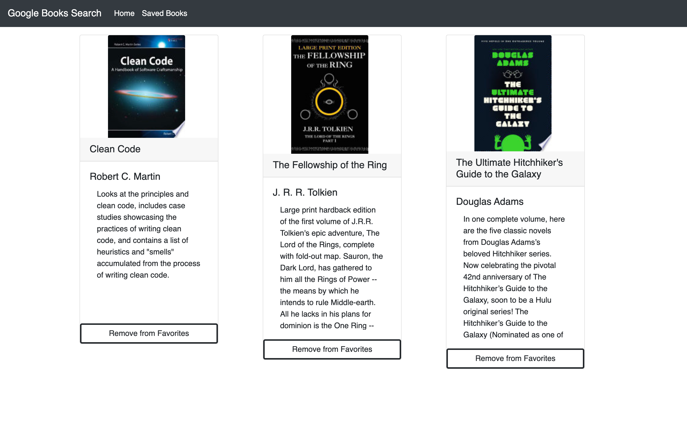

# Google Books Search

[Deployed App]()  
[GitHub Repo](https://github.com/kylegrabski/google-books-search)  

## Overview  
This site allows users to search for books using Google Books API. The user can click on the image and be sent to the selected books Google information. Users can also favorite books and view them in the Saved Books page.  

   

### Main Page
  

  

### Saved Books Page

   

## Tech And Libraries Used  

>Javascript  
React  
React-Bootstrap  
MongoDB  

   
   
   

For any questions please feel free to reach out to me via email.  
Thank you  

   
Kyle Grabski  

kyle.grabski@gmail.com
